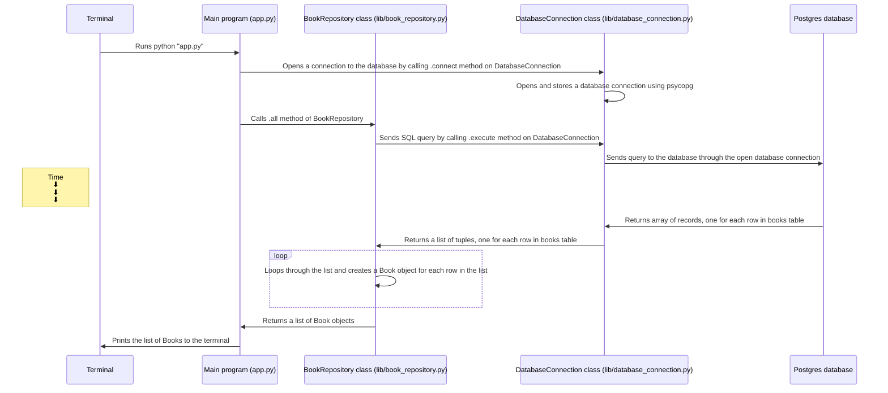

```mermaid
sequenceDiagram
    participant t as Terminal
    participant app as Main program (app.py)
    participant br as BookRepository class (lib/book_repository.py)
    participant db_c as DatabaseConnection class (lib/database_connection.py)
    participant db as Postgres database 

    t->>app: Runs python "app.py"
    app->>db_c: Opens a connection to the database by calling .connect method on DatabaseConnection
    db_c->>db_c: Opens and stores a database connection using psycopg
    app->>br: Calls .all method of BookRepository
    br->>db_c: Sends SQL query by calling .execute method on DatabaseConnection
    db_c->>db: Sends query to the database through the open database connection

    Note left of t: Time <br /> ⬇︎ <br /> ⬇︎ <br /> ⬇︎

    db->>db_c: Returns array of records, one for each row in books table
    db_c->>br: Returns a list of tuples, one for each row in books table
    loop
        br->>br: Loops through the list and creates a Book object for each row in the list
    end
    br->>app: Returns a list of Book objects
    app->>t: Prints the list of Books to the terminal
```